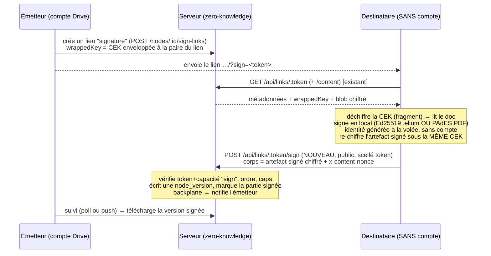

# Approche A — Signature à distance par lien cloud (document d'architecture)

> **Statut : PROPOSITION à valider avant tout code.** Rédigé 2026-08-11, ancré sur le
> backend `server/` réel (Fastify/TS, zero-knowledge) et le client `web-studio/`.
> À relire en premier dans une session « démarrage Approche A ».

## 1. Objectif

Aujourd'hui la **demande de signature par fichier (Approche B) est complète** : le circuit
parapheur voyage dans le `.elium` (`parapheur/circuit.json`), on exporte le fichier, le
destinataire le signe (identité Ed25519 générée à la volée, **sans compte**) et le renvoie
manuellement. PDF : le destinataire signe le PDF reçu en PAdES.

**Approche A** ajoute le confort « SaaS » : l'émetteur envoie un **lien**, le destinataire
**clique → signe en ligne → le fichier signé revient tout seul**, avec **suivi de statut**
côté émetteur. Le destinataire reste **sans compte**. C'est un chantier backend de plusieurs
semaines car il faut ouvrir une **écriture-retour anonyme scellée par token**, que l'infra
n'a pas encore.

## 2. État réel de l'infra (vérifié dans le code, 2026-08-11)

| Brique | Fichier | État |
|---|---|---|
| Lien de partage anonyme E2E | `server/src/routes/shares.ts` | ✅ **GET only** : `GET /api/links/:token` (métadonnées + `wrappedKey`) et `GET /api/links/:token/content` (blob chiffré en flux). Clé enveloppée dérivée du **secret dans le fragment d'URL** (jamais envoyé au serveur), seul `sha256(token)` est stocké. Caps : `expires_at`, `max_downloads`, `download_count`, `revoked_at`. Rôle attaché (`role_id`). |
| Ouverture de lien côté client | `web-studio/src/drive-cloud/ui/OpenLinkView.tsx`, `App.tsx` route `?link=<token>#k=<privHex>.<pubHex>` | ✅ 100 % client (déchiffre via la paire du lien). |
| Écriture de contenu versionnée | `server/src/routes/nodes.ts` `PUT /:id/content` | ✅ mais **account-gated** : flux octet-stream + `x-content-nonce`, quota en transaction, snapshot `node_versions` (version_no++), `key_epoch` (rotation clé org), `kickRoom`, audit. |
| Écriture-retour **anonyme** | — | ❌ **MANQUE** — c'est le cœur d'Approche A. |
| Table de statut de demande | — | ❌ **MANQUE** (le circuit ne vit pas en base). |
| Backplane Redis multi-instance | `server/src/collab/backplane.ts` | ✅ **déjà présent** (relay collab + rate-limit acceptent `REDIS_URL`). |
| Migrations versionnées | `server/src/db/migrations/000N_*.sql` + `migrate.ts` | ✅ (prochaine = `0004_*.sql`, jouées au démarrage). |
| Déploiement VPS auto-update | `install.sh auto-update`, edit.nmty.fr | ✅ (commit signé → déploiement + health-check/rollback). Caddy proxie déjà `/api/*`. |

**Bonne nouvelle** : deux prérequis que la mémoire listait « à faire » (Redis backplane,
migrations versionnées) **existent déjà**. Le vrai travail neuf = écriture-retour + statut + UI.

## 3. Principe cryptographique (zero-knowledge préservé)

La clé de tout : le destinataire **possède déjà la CEK** du document via le secret du fragment
d'URL (mécanisme du lien existant). Donc il peut **déchiffrer pour lire** *et* **re-chiffrer
sous la même CEK** pour renvoyer — **le serveur ne voit toujours que du ciphertext.**

Le serveur ne stocke jamais : CEK, clé privée du signataire, contenu en clair. Il stocke :
ciphertext de l'artefact signé (nouvelle version), et un **statut** (partie X signée à telle
date, empreinte de clé publique du signataire pour attribution). La **vérité d'intégrité**
reste interne à l'artefact (sceau Ed25519 `.elium` / preuves, ou CMS PAdES du PDF) — le
transport serveur n'est pas de confiance, comme pour l'Approche B.

## 4. Backend — conception

### 4.1 Capacité « signer » sur un lien
Deux options (**décision produit**, cf. §7) :

- **Option Lean** — étendre `share_links` : colonne `can_sign BOOLEAN`, `party_index INT`,
  `signed_at`, `signer_fpr TEXT`, `submission_version_id UUID`. Un lien = une partie. L'émetteur
  crée N liens (un par signataire) et suit leurs statuts. Peu de code, pas de nouvelle notion.
- **Option Circuit** — tables dédiées :
  - `signature_requests(id, node_id, org_id, created_by, created_at, status, ordered BOOLEAN, deadline, note_encrypted…)`
  - `signature_request_parties(id, request_id, party_index, link_id→share_links, status[pending|signed|declined], signed_at, signer_fpr, submission_version_id)`
  Chaque partie s'appuie sur un `share_links` **capacité sign**. Gère nativement l'ordre, le
  multi-parties, les relances, le refus. Plus de code, mais c'est le vrai modèle « parapheur cloud ».

Recommandation : **Option Circuit** (aligne le cloud sur le circuit local déjà modélisé
`EliumParapheur`/`ParapheurParty`), mais livrable en 2 temps (mono-partie d'abord, cf. §8).

### 4.2 Route publique d'écriture (le cœur)
`POST /api/links/:token/sign` dans un **nouveau** `server/src/routes/signing.ts`
(register dans `app.ts` avec `prefix: "/api"`, **sans** hook `authenticate` global — modèle
de `shares.ts`). Elle **reproduit `PUT /:id/content`** mais scellée par token :

1. `resolveLink(token)` (réutilisé) **+** contrôle `can_sign` / partie pending / non révoqué / non expiré.
2. Si `ordered`, refuser tant que la partie précédente n'a pas signé.
3. Flux octet-stream borné (`storage/util.ts ByteCounter`, cap dédié « écriture signature ») + `x-content-nonce`.
4. **En transaction** : quota org, `INSERT node_versions` (version_no++ , `key_epoch` courant),
   `UPDATE nodes.content_ref/nonce/size/current_version_id/modified_at`, marquer la partie
   `signed` (+ `signed_at`, `signer_fpr` optionnel, `submission_version_id`), recalculer le
   statut de la demande (toutes signées → `completed`).
5. `notifyOrg` / backplane → la vue émetteur se met à jour ; `audit("node.sign.submit", …)`.
6. **Anti-abus** : rate-limit par route (déjà dispo, Redis en multi-instance), cap taille,
   **one-shot par partie** (pas d'écrasement après `signed` sauf ré-ouverture explicite),
   `expires_at`, révocation, 404 générique (jamais dire « token inconnu vs expiré »).

### 4.3 Statut pour l'émetteur
- **v1 (simple)** : `GET /api/nodes/:id/signature-request` (authentifié) → parties + statuts +
  version signée. L'UI émetteur **poll** (léger, robuste, aucune socket).
- **v2 (live)** : push via le relay/`notifyOrg` existant (WS déjà branché) ou SSE.

### 4.4 Migration & déploiement
- `server/src/db/migrations/0004_signature_requests.sql` (idempotent, `CREATE TABLE IF NOT EXISTS`,
  `ALTER TABLE share_links ADD COLUMN IF NOT EXISTS …`). Jouée au démarrage par `migrate.ts`.
- Nouvelle permission RBAC `node.sign.request` (créer une demande) dans le catalogue `rbac/`.
  La capacité **signer** est portée par le **token du lien**, pas par un rôle de compte
  (le signataire n'a pas de compte).
- Déploiement : commit signé sur `master` → auto-update VPS (edit.nmty.fr) ; migration auto au boot.

## 5. Client (`web-studio/`) — conception

- **Émetteur** (`panels/ParapheurPanel.tsx`, à côté du « Envoyer une demande » actuel) : si
  connecté au Drive, bouton **« Demander la signature par lien »** → upload/забезпечити le
  `.elium` comme `node` (ou nœud existant) → `createSignLink` par partie → **tableau de suivi**
  (poll `signature-request`) + **copie du lien** par partie (pas d'email en v1). Réutilise
  `drive-cloud/ops.ts` (wrap CEK à la paire du lien) et `session.tsx`.
- **Destinataire** (nouveau `drive-cloud/ui/SignLinkView.tsx`, route `?sign=<token>#k=…`,
  branchée dans `App.tsx` à côté de `?link=`) : résout + déchiffre + **rend le document** +
  **flux de signature** réutilisant `sign/SignatureCreator.tsx` (.elium) ou le signeur PAdES
  `pdf/ops/pades.ts` (PDF) → génère l'identité Ed25519 à la volée si besoin (**sans compte**,
  comme B) → re-chiffre l'artefact signé sous la CEK → `POST …/sign`.
- **Prérequis** : l'**émetteur** doit avoir un compte Drive (le doc doit vivre côté serveur) ;
  le **destinataire non** (décision validée historiquement : signer sans compte).

## 6. Sécurité & menaces

- **Possession du lien = capacité** (comme tout lien de partage). Un porteur du lien peut
  poster un artefact : mitigations = one-shot/partie, cap taille, expiry, révocation,
  l'émetteur **relit et accepte** la version signée avant de la considérer finale, et surtout
  la **preuve d'intégrité est interne** (sceau/preuve Ed25519 `.elium`, CMS PAdES) — le serveur
  n'est qu'un transport. Un artefact bidon échoue la vérification côté émetteur.
- **Zero-knowledge intact** : le serveur ne voit ni CEK ni clé privée ni clair (§3).
- **Énumération/DoS** : token 32 o (déjà), `sha256` stocké, rate-limit Redis, quotas, 404 générique.
- **Attribution** : stocker `signer_fpr` (empreinte de clé publique) permet à l'émetteur
  d'attribuer via le carnet de confiance + safety-words. C'est de la **PII faible** → décision §7.
- **PAdES** : rappel — un auto-signé reste « identité non vérifiée » dans Adobe ; pour la coche
  verte il faut un `.p12` d'une AC (hors périmètre A).

## 7. Décisions à trancher (avant code)

1. **Modèle** : `share_links` étendu (Lean) **vs** tables `signature_requests` dédiées (Circuit, recommandé) ?
2. **Attribution serveur** : stocker `signer_fpr` en clair (attribution facile) **vs** rien (le serveur ignore qui a signé, attribution 100 % dans l'artefact) ?
3. **Ordre** : circuit **ordonné** (partie N après N-1) dès v1, ou parallèle d'abord ?
4. **Suivi** : **poll** (v1, simple) ou **push WS/SSE** dès le départ ?
5. **Portée v1** : **`.elium` d'abord** puis PDF, ou les deux d'emblée ?
6. **Invitation** : lien copié à la main (comme B) ou **envoi e-mail** (nécessite infra mail — probablement hors v1) ?
7. **Refus/relance/deadline** : dans v1 ou v2 ?

## 8. Découpage proposé (réduire le risque)

- **Tranche 0 — schéma & route (backend)** : migration `0004`, `signing.ts` mono-partie
  (`POST /links/:token/sign` + `can_sign` + `GET …/signature-request`), tests d'intégration.
- **Tranche 1 — client mono-partie** : émetteur crée 1 lien de signature + suivi par poll ;
  destinataire `SignLinkView` signe un `.elium` sans compte et renvoie. E2E navigateur.
- **Tranche 2 — circuit multi-parties + ordre** : tables `signature_requests`, ordre, statut global.
- **Tranche 3 — PDF (PAdES) par lien** + push live (WS/SSE) + refus/relance/deadline.
- **Tranche 4 — durcissement** : quotas dédiés, audit complet, révocation, tests de charge, doc in-app.

Chaque tranche = commit(s) signé(s) + release + `install.sh update` VPS + tests verts
(vitest/pytest/tsc + intégration serveur).

## 9. Points d'ancrage code (pour démarrer vite)

- Route modèle (public + auth mixés, `resolveLink`, caps) : `server/src/routes/shares.ts`.
- Écriture versionnée à reproduire : `server/src/routes/nodes.ts` `PUT /:id/content` (flux, `ByteCounter`, `node_versions`, `key_epoch`, `kickRoom`, quota en tx).
- Enregistrement : `server/src/app.ts:126` (`shareRoutes` prefix `/api`) → ajouter `signingRoutes`.
- Migrations : `server/src/db/migrations/` + `migrate.ts` (idempotent, au boot).
- Backplane multi-instance : `server/src/collab/backplane.ts`, `relay.ts` (`notifyOrg`, `kickRoom`).
- Client lien existant : `web-studio/src/drive-cloud/ui/OpenLinkView.tsx`, `ops.ts` (`createShareLink`, `openSharedLink`), `App.tsx` route `?link=`.
- Signature locale à réutiliser : `web-studio/src/sign/SignatureCreator.tsx` (.elium), `pdf/ops/pades.ts` (PDF), `sign/keys.ts` (identité à la volée).
- Circuit local déjà modélisé (à refléter côté cloud) : `format/types.ts` `EliumParapheur`/`ParapheurParty`, `panels/ParapheurPanel.tsx`.
